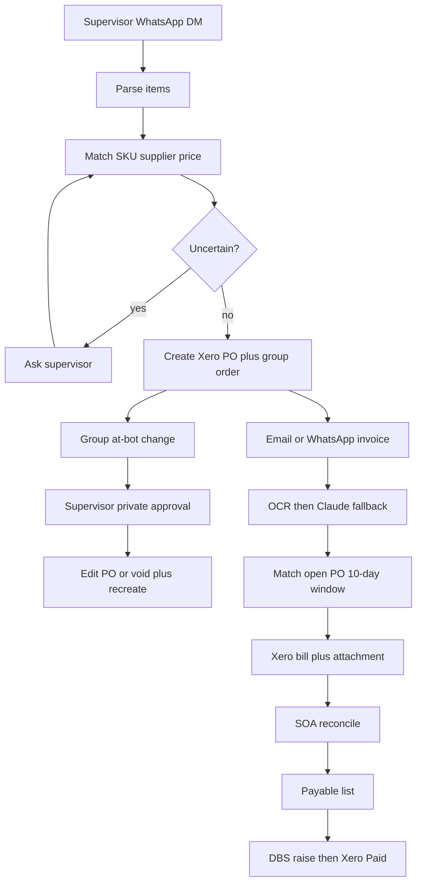

# Phase 1 implementation plan

**Status:** Saved, not started. Resume here next session.
**Saved:** 18 Sep 2026
**Source requirements:** [requirement.md](requirement.md)
**Cursor plan:** `phase_1_gap_fill_756e36b8`

## How to resume tomorrow

1. Open this file and [requirement.md](requirement.md).
2. Tell the agent: implement the Phase 1 plan, starting at **todo 0 (shared plumbing)**.
3. Do not skip ahead — each slice feeds the next.

## Progress

| # | Slice | Status |
|---|--------|--------|
| 0 | Shared plumbing | pending |
| 1 | PO intake | pending |
| 2 | Invoice capture | pending |
| 3 | SOA reconciliation | pending |
| 4 | DBS payment | pending |
| 5 | DRY_RUN tests + Admin fixtures | pending |

---

# Phase 1: fill existing workflow gaps

The four sub-processes already exist as scaffolds. Models and `ApprovalGateType` values in [prisma/schema.prisma](prisma/schema.prisma) already cover SKU mapping, discrepancy, SOA, and DBS standby. The changes are almost entirely in workflow logic and a few stubbed services — not a rewrite.

Implement in this order because each step feeds the next: shared plumbing → PO intake → invoice capture → SOA reconciliation → DBS payment.



---

## 0. Shared plumbing (do first)

**WhatsApp group routing is currently dead.** [src/api/webhooks/whatsapp.ts](src/api/webhooks/whatsapp.ts) hardcodes `isGroup: false`, so group `@bot remove salmon` and group reconcile never fire.

- Parse group metadata from the Meta payload (`from` / `context` / group id when present); set `isGroup` and `groupId`.
- Keep `@bot` text match for `mentionsBot` (Cloud API mention entities are unreliable).
- One workflow run **per invoice attachment** in email scan ([src/orchestrator/router.ts](src/orchestrator/router.ts) currently uses one run for the whole inbox).

**Approval resume is broken.** Invoice and reconciliation `onApprovalResolved` mark the run `COMPLETED` instead of continuing. Standardize: keep `AWAITING_APPROVAL` payload on the run, then on resolve re-enter the same workflow at the next step. Apply this in:

- [src/workflows/po-intake/index.ts](src/workflows/po-intake/index.ts)
- [src/workflows/invoice-capture/index.ts](src/workflows/invoice-capture/index.ts)
- [src/workflows/reconciliation/index.ts](src/workflows/reconciliation/index.ts)

**Follow-ups.** [FollowUpTask](prisma/schema.prisma) exists but the worker never handles `"follow-up"`. Wire a 30-minute reminder for unanswered clarifications / DBS standby.

**Xero API surface** in [src/services/xero.service.ts](src/services/xero.service.ts):

- Add OAuth scope `accounting.purchaseorders` (create already uses `/PurchaseOrders`).
- Implement: list items (SKU match), get/update/void PO, search ACCPAY bills by contact + invoice number, create bill from PO lines, upload attachment, update invoice status (`AUTHORISED` vs `PAID`).
- Replace stubs: `convertPoToBill` (throws), `findDuplicateBill` (local DB only), `getOpenPurchaseOrders` (`[]`), `getBillsForPeriod` (`[]`), `updateBillStatus` (throws).

---

## 1. Purchase request → PO ([requirement.md](requirement.md) §1)

Today: parse → pick **first** supplier → yes/no confirm → Xero PO with `unitAmount: 0` → group message. Modification is a scaffold WhatsApp.

**Parse** ([src/services/llm.service.ts](src/services/llm.service.ts)):

- Keep colon-format local parser; extend it (or always use LLM when keyed) for freeform `"Bok choy 10kg, zucchini 40kg"`.
- Stop dropping `supplier` from parsed items (`PO_PARSE_PROMPT` already returns it).

**Resolve before confirm** (new helper, used by [src/workflows/po-intake/index.ts](src/workflows/po-intake/index.ts)):

- Match item names to Xero Items; fall back to [SupplierSkuMapping](prisma/schema.prisma).
- Infer supplier: explicit name in the message, else most recent PO for that SKU; never default to `findFirst` by `createdAt`.
- Look up last `PurchaseOrderLine.unitPrice` (same supplier + item). If none, use `NEW_PO_PRICE` instead of writing `0`.
- If SKU, supplier, or price is ambiguous, ask (`SKU_CLARIFICATION` / `SUPPLIER_CLARIFICATION` / `NEW_PO_PRICE`) — do not guess. Handle `SUPPLIER_CLARIFICATION` on resolve (currently ignored).

**Create:** generate PO number, send formatted order to `supplier.whatsappGroupId`, immediately `createPurchaseOrder` with `ItemCode` + real unit amounts. No wait for supplier confirmation. Persist `xeroItemId` / `unitPrice` on lines.

**Group modification:**

- `handleModification` must: resolve supplier from `groupId`, load that supplier’s open PO, parse the requested change, DM supervisor with PO number + proposed lines.
- On approval: PUT the Xero PO; if it is no longer editable (`BILLED` / validation error), void/delete and recreate, then update local `PurchaseOrder` + lines.

---

## 2. Invoice → validate vs PO → Xero bill ([requirement.md](requirement.md) §2)

Today: WhatsApp image works; IMAP returns `[]`; any latest `SUBMITTED` PO is treated as a match; live bill create throws; approvals do not resume.

**Intake**

- Implement IMAP in [src/services/email.service.ts](src/services/email.service.ts) with already-installed `imapflow`. Scan the invoice inbox, whitelist sender domain, process **each attachment as its own run**, then move/mark processed.
- Keep WhatsApp team-member upload as-is.

**Extract** ([src/services/ocr.service.ts](src/services/ocr.service.ts)):

- If org OCR is Google/AWS, run Document AI / Textract first.
- If fields are below `CONFIDENCE_THRESHOLD` (0.75), call existing Claude vision (`extractInvoiceFromImage`) and unused `refineInvoiceExtraction`.
- Ask a human only if both still uncertain (`FIELD_CONFIRMATION`), then **resume** `processInvoice` with confirmed values.
- Accept PDF (email invoices); convert or send to Document AI — current code rejects non-images.
- If `signedOrStamped` is false: WhatsApp a **warning**, do not reject.

**Validate then bill** in [src/workflows/invoice-capture/index.ts](src/workflows/invoice-capture/index.ts):

- Duplicate check: Xero ACCPAY search by supplier + invoice number (not only local `xero_bills`).
- Match an **open** PO for that supplier whose date is within **10 days before** the invoice date (`getOpenPurchaseOrders`).
- Translate supplier line names via `SupplierSkuMapping`. Unknown name → `SKU_MAPPING_CONFIRMATION` once, then persist.
- Quantity must match PO lines exactly; invoice total vs PO total within **S$0.10**. Line/qty/amount mismatch → `DISCREPANCY_RESOLUTION` and stop.
- On match: create ACCPAY bill from PO, attach original file, write `XeroBill`, mark candidate processed.
- No matching PO → existing `CREATE_PO_FROM_INVOICE` question; on yes actually create the PO then continue to the bill (replace the scaffold message).

---

## 3. Month-end SOA → payable list ([requirement.md](requirement.md) §3)

Today [src/workflows/reconciliation/index.ts](src/workflows/reconciliation/index.ts) skips SOA entirely: previous-month local bills → payable JSON → auto-enqueue DBS.

Replace `runReconciliation` with a real state machine using existing gates (`RECONCILIATION_SOURCE_CHOICE`, `NEW_SOA_DETECTION`, `MISMATCH_RESOLUTION`, `PRIOR_BALANCE_SCOPE`, `ORDER_RECEIVED_CONFIRMATION`).

- Triggers: supervisor DM (parse supplier + optional period; default previous calendar month), group `@bot` reconcile, or SOA document detected.
- Search IMAP + that supplier’s WhatsApp group for SOA (subject/filename terms + layout via OCR/LLM).
- No SOA: ask Xero-only vs request SOA from supplier.
- During daily email scan, if an SOA arrives, prompt `NEW_SOA_DETECTION` instead of treating it as an invoice.
- Extract invoice numbers, amounts, balance due; compare to Xero (`getBillsForPeriod`). Buckets: matched, missing from Xero, amount mismatch, plus Xero bills absent from the SOA.
- Older unpaid balances: `PRIOR_BALANCE_SCOPE` — full outstanding / current month / custom amount. Do not auto-pay them.
- SOA invoice missing in Xero: WhatsApp the supplier for that invoice. When it arrives, extract/validate but **do not create a bill** until `ORDER_RECEIVED_CONFIRMATION`. Then create the bill and add it to the payable list.
- Send the full summary (SOA totals, Xero totals, mismatches, missing, payable list). Keep the existing `reconciliation.payable.ready` handoff into DBS.

---

## 4. Payable list → DBS → Xero paid ([requirement.md](requirement.md) §4)

Shell in [src/workflows/payment-execution/index.ts](src/workflows/payment-execution/index.ts) is close: payee check, `DBS_STANDBY`, then stub raise + 4h monitor.

Implement [src/services/dbs-playwright.service.ts](src/services/dbs-playwright.service.ts) (Playwright is already a dependency):

- Session lock (`isSessionAvailable` is always `true`). If occupied, retry in 30 minutes as the workflow already messages.
- **Never create payees.** Confirm the saved `dbsPayeeName` exists in DBS; stop if missing (already stops on empty DB field).
- After supervisor replies `ready`: log in (triggers mobile approve). Then check DBS history for a prior raise of the same supplier/amount/ref (anti-duplicate).
- Select saved payee, amount, category **Business Expenses**, month/invoice refs, review, submit, capture transaction ref.
- Process multiple supplier batches in the **same** logged-in session when several payables are ready.
- After raise: Xero bills **Awaiting Payment** only (`updateBillStatus`), not Paid.
- Keep the 4h `payment.monitor` cron; `checkPaymentApproval` must actually inspect DBS. On approval: mark bills **Paid** and WhatsApp the supervisor.

Keep `DRY_RUN` as the safe default until the office DBS session is configured.

---

## Files expected to change

| Area | Files |
|------|--------|
| Routing / resume | [src/api/webhooks/whatsapp.ts](src/api/webhooks/whatsapp.ts), [src/orchestrator/router.ts](src/orchestrator/router.ts), [src/jobs/queue.ts](src/jobs/queue.ts) |
| PO | [src/workflows/po-intake/index.ts](src/workflows/po-intake/index.ts), [src/services/llm.service.ts](src/services/llm.service.ts) |
| Invoice | [src/workflows/invoice-capture/index.ts](src/workflows/invoice-capture/index.ts), [src/services/ocr.service.ts](src/services/ocr.service.ts), [src/services/email.service.ts](src/services/email.service.ts) |
| SOA / pay | [src/workflows/reconciliation/index.ts](src/workflows/reconciliation/index.ts), [src/workflows/payment-execution/index.ts](src/workflows/payment-execution/index.ts), [src/services/dbs-playwright.service.ts](src/services/dbs-playwright.service.ts) |
| Xero | [src/services/xero.service.ts](src/services/xero.service.ts) |
| Shared new | SKU mapping helper; SOA extract prompt in [src/prompts/system.ts](src/prompts/system.ts); types in [src/types/index.ts](src/types/index.ts) |

Schema changes should be minimal (optional: `orderDate` on `PurchaseOrder` if `createdAt` is not enough for the 10-day window; a small DBS session-lock row if Redis is not used). Existing enums already match the gates.

Admin UI ([public/admin](public/admin)): add Activity test fixtures for group message, invoice, email scan, reconcile, and simulate DBS approved. SKU-mapping visibility is still optional.

---

## Out of scope (already excluded by Phase 1)

Non-inventory invoices, bank-statement reconciliation, expense claims, payroll, GST. Creating new DBS payees.

---

## Testing: DRY_RUN walkthrough + cases

There is no test suite today (`package.json` has no `test` script). Verification for this work is **DRY_RUN manual walkthroughs first**, plus a small automated suite for parsers/matching so regressions do not need live WhatsApp.

### What `DRY_RUN=true` does and does not do

Keep `DRY_RUN=true` in `.env` (already the default). Restart API + worker after changing it.

| Layer | With DRY_RUN=true |
|-------|-------------------|
| Xero writes (PO, bill, status, attach) | Simulated. Logs `[DRY_RUN] …` and returns mock IDs like `DRY-PO-…` / `DRY-BILL-…`. **No live Xero documents.** |
| DBS login / raise / history | Simulated. Logs `[DRY_RUN] DBS payment raised` and a `DRY-DBS-…` ref. **No bank session.** |
| Local Postgres | **Real writes.** POs, invoice candidates, bills, reconciliation, payment batches still persist. Check Admin → Activity and Prisma Studio. |
| WhatsApp outbound | **Still sends** if WhatsApp is configured. Use Admin test endpoints to avoid needing a phone for inbound. |
| OCR | Mock sample invoice if `OCR_PROVIDER=mock` and no `ANTHROPIC_API_KEY`; otherwise Claude still reads the real photo. |

Implementation must extend DRY_RUN mocks to every new Xero/DBS method (update/void PO, list items, search bills, attach file, approval check) so live APIs are never required for these tests.

### Preconditions (once)

1. App + worker running (`npm run dev` and `npm run worker`).
2. Admin at `http://127.0.0.1:3000/admin`, org with a **supervisor** phone and at least one **active supplier** (name, optional WhatsApp group ID, DBS payee name for payment tests).
3. Activity tab open. Watch worker logs for `[DRY_RUN]`.

---

### Operation 1 — Purchase request → PO

**Happy path (Admin, no phone inbound)**

1. Activity → **Test WhatsApp webhook** with:
   ```
   - Bok choy: 10 kg
   - Zucchini: 40 kg
   ```
2. Supervisor WhatsApp (or logs) shows confirm prompt with inferred supplier + SKUs + last prices.
3. Reply `yes`.
4. Expect: `PO_INTAKE` **COMPLETED**; local `PurchaseOrder` with priced lines; log `[DRY_RUN] Xero PO created`; group order text logged/sent with PO ref. **No wait for supplier confirmation.**

**Cases**

| Case | How | Pass |
|------|-----|------|
| Freeform parse | Webhook: `Bok choy 10kg, zucchini 40kg` | Same confirm prompt as colon format |
| Uncertain SKU | Item name that matches none / several Xero items | Asks; does not create PO until answered |
| Uncertain supplier | No history and no name in message, or two possible suppliers | `SUPPLIER_CLARIFICATION`; resume after reply (not complete-and-stop) |
| New price | SKU known, no prior `unitPrice` | `NEW_PO_PRICE`; after confirm, lines are not `0` |
| Help / garbage | `hello` or `help` | Guide only; no PO |
| Cancel | Reply `no` on confirm | `CANCELLED`; no local PO |

**Group modification**

1. Create a PO as above.
2. Simulate a **group** inbound (after plumbing): `isGroup=true`, `groupId` = supplier WhatsApp group, text `@bot remove salmon` (or `@bot remove zucchini`).
3. Supervisor gets a **private** DM with PO number + proposed change. Xero/local PO must **not** change yet.
4. Reply `yes` → log `[DRY_RUN]` PO update (or void+recreate); local lines match.
5. Reply `no` → PO unchanged.

Need a new Admin test hook for group messages (`isGroup` / `groupId`) — current webhook tester always sends a DM (`isGroup: false`).

---

### Operation 2 — Invoice → bill

**Happy path**

1. Complete a matching PO first (same supplier, qty, within 10 days).
2. From a **team member** phone, WhatsApp a clear invoice **photo**. Without Anthropic, OCR mock always reads Fresh Farms / INV-2026-0001 / S$35 — seed that supplier and a matching PO, or set the API key.
3. Expect chop warning if unsigned (does not reject); then `[DRY_RUN] Xero bill created`; `INVOICE_CAPTURE` **COMPLETED**; local `XeroBill` linked to the PO.

**Cases**

| Case | How | Pass |
|------|-----|------|
| Duplicate | Send the same invoice number again | `Duplicate invoice skipped`; no second bill |
| No matching PO | Invoice for a supplier with no open PO in the 10-day window | Asks create retrospective PO; `yes` creates DRY PO then DRY bill; `no` stops |
| Qty mismatch | Invoice qty ≠ PO qty | `DISCREPANCY_RESOLUTION`; no bill until resolved |
| Amount within 10 cents | Total off by S$0.10 | Auto-creates bill |
| Amount over tolerance | Total off by S$0.11+ | Stops for supervisor |
| New SKU wording | Supplier line name not in mapping | `SKU_MAPPING_CONFIRMATION` once; second invoice with same name maps automatically |
| Low confidence | Blurry photo / mock low fields | `FIELD_CONFIRMATION`; after confirm, processing **resumes** (not marked complete) |
| Email multi-attach | Two invoice files in one scanned email (or Admin fixture) | Two `INVOICE_CAPTURE` runs |

Email IMAP: if inbox is not available, add an Admin **Test email scan** that injects fixture attachments so DRY_RUN still covers the per-file path.

---

### Operation 3 — SOA reconciliation → payable list

**Happy path**

1. Have at least one unpaid local `XeroBill` dated in the **previous calendar month**.
2. Supervisor DM: `Please reconcile payment for Fresh Farms`.
3. If no SOA: bot asks Xero-only vs request SOA. Reply Xero-only for the first DRY_RUN.
4. Expect summary (matched / missing / mismatch / Xero-not-on-SOA) and a payable list; `RECONCILIATION` completed; payment job enqueued.

**Cases**

| Case | How | Pass |
|------|-----|------|
| Default period | No month in the message | Previous calendar month |
| No SOA choice | Do not plant an SOA | `RECONCILIATION_SOURCE_CHOICE` |
| Amount mismatch | SOA total ≠ Xero bill | `MISMATCH_RESOLUTION`; not silently paid |
| Prior balance | Older unpaid bills exist | `PRIOR_BALANCE_SCOPE`: full / current month / custom |
| Missing from Xero | SOA has an invoice Xero lacks | Bot asks supplier for that invoice; when it arrives, **no bill** until `ORDER_RECEIVED_CONFIRMATION` |
| New SOA in email scan | Fixture filename/subject containing `SOA` / `statement` | `NEW_SOA_DETECTION` prompt, not invoice capture |
| Group trigger | Group `@bot reconcile` | Same flow, supplier inferred from group |

---

### Operation 4 — DBS payment

**Happy path**

1. After a payable list exists, supervisor gets standby: reply `ready`.
2. Expect log `[DRY_RUN] DBS payment raised` + `DRY-DBS-…` ref; bills **AWAITING_PAYMENT** locally (not PAID); `PAYMENT_EXECUTION` completed.
3. Trigger monitor (`payment.monitor` job or wait for 4h cron). In DRY_RUN, approval check is simulated — implementation should support a **test override** (Admin “simulate DBS approved”) so we can confirm bills go **PAID** and supervisor is notified without a real bank.

**Cases**

| Case | How | Pass |
|------|-----|------|
| No saved payee | Clear supplier `dbsPayeeName` | Stops; does not create a payee |
| Not ready | Ignore or reply something other than `ready` | Does not log in / raise |
| Duplicate raise | Run payment twice for same supplier/amount/ref | Second run skipped via history check (DRY_RUN fake history) |
| Session busy | Hold a lock, enqueue second supplier | “retry in 30 minutes”; first session can still process multiple batches |
| Raised ≠ Paid | After raise, before simulate-approve | Xero/local status is Awaiting Payment only |

---

### Automated tests to add during implementation

Add `vitest` (or `node:test`) and cover pure logic without WhatsApp/Xero:

- PO parse: colon format, freeform `Bok choy 10kg, zucchini 40kg`, help/garbage rejected
- Supplier inference + last-price lookup from fixture PO lines
- Invoice vs PO: exact qty, ±S$0.10 total, 10-day window, duplicate key
- SKU mapping persist-after-confirm
- SOA buckets: matched / missing Xero / amount mismatch / Xero absent from SOA
- Approval resume: FIELD_CONFIRMATION and CREATE_PO_FROM_INVOICE continue the run
- DRY_RUN xero/dbs services return mock IDs and never call fetch

Admin Activity should gain test buttons for: **group message**, **invoice fixture**, **email scan fixture**, **reconcile**, **simulate DBS approved**. Existing PO webhook tester stays.

Update [END_TO_END_TESTING_GUIDE.md](END_TO_END_TESTING_GUIDE.md) after each slice so the DRY_RUN steps above stay the operator playbook.
